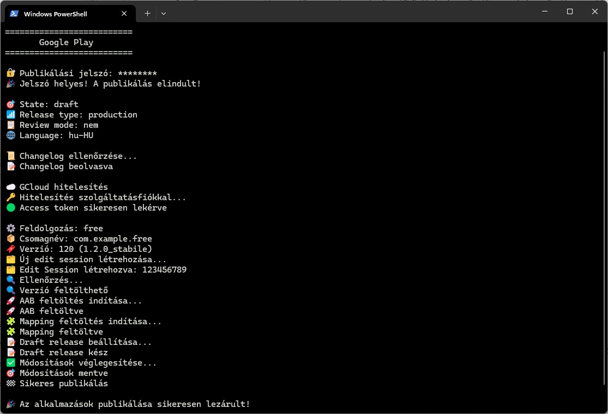

## 🚀 App Publisher – Google Play & Huawei AppGallery

Ez a rendszer **automatikus alkalmazásfrissítések** kezelésére szolgál Android platformokon.
A cél, hogy a már kiadott alkalmazások új verzióinak feltöltése és publikálása **teljesen automatizáltan** történjen, minimális manuális beavatkozással.

> ❗ **Fontos:** Ezek a szkriptek nem alkalmasak új alkalmazások létrehozására, képernyőképek vagy leírások módosítására. Kizárólag meglévő alkalmazások frissítésére használhatók.

---

### 💻 Rendszerkövetelmények

A fejlesztés **Windows 11** környezetben működik.

* **bundletool** – [Dokumentáció és letöltés](https://developer.android.com/tools/bundletool)
* **gcloud CLI** – [Telepítés és beállítás](https://docs.cloud.google.com/sdk/docs/install)
* **Java JBR** – az Android Studio beépített JDK-ja, elérési út pl.: `C:\Program Files\Android\Android Studio\jbr`

### 📁 Fájlszerkezet

A projekt általános struktúrája:

```
app
 ├── free
 │   ├── app-free-release.aab
 │   ├── app-free-release.apk
 │   └── mapping.txt
 ├── paid
 ├── dev
release
 ├── publish_changelog.txt
 ├── publish_gms.ps1
 ├── publish_hms.ps1
 ├── service-account.json
 ├── release_all.bat
 ├── bundletool.jar
 └── keystore
     ├── free.jks
     ├── paid.jks
     └── dev.jks
```

> 📦 A `release` mappát az **Android projekt gyökérkönyvtárába** kell másolni, hogy a szkriptek megfelelően működjenek a Gradle, a build és a bundletool hivatkozásokkal.

### ⚙️ Áttekintés

A szkriptek célja, hogy az elkészült **AAB/APK/mapping** fájlokat feltöltsék a megfelelő áruházba,
majd a releaset automatikusan véglegesítsék.

* **Google Play Console** – Android Publisher API-n keresztül (`publish_gms.ps1`)
* **Huawei AppGallery Connect** – AppGallery API-n keresztül (`publish_hms.ps1`)

### 🧠 Használat

A szkriptek futtatása PowerShell-ből:

```
./publish_gms.ps1
./publish_hms.ps1
```

- A futtatás előtt jelszóval hitelesítünk: `yyyyMMdd`
- A feltöltendő fájltípust, hogy AAB vagy APK kerül feltöltésre: a kódban kerül meghatározásra!
- Alapértelmezetten csak mentésre kerülnek a feltöltések. Azok felülvizsgálra küldése a fejlesztő feladata!

> ⚠️ A Huawei rendszerébe a mapping.txt fájl nem tölthető fel, ezért a `publish_hms.ps1` ezt automatikusan kihagyja.

### 🧩 Hibakezelés és naplózás

A hibák a következő fájlba kerülnek: `publish_error_details.txt`

* Sikertelen API-hívások válasza
* Hálózati hibákat és timeoutok
* Feltöltési hibák részletei

---

### 🔧 Alkalmazások előkészítése

A `release_all.bat` a teljes build-folyamatot automatizálja, és előkészíti a publikáláshoz szükséges fájlokat.

* Több app buildelése Gradle segítségével
* Az elkészült AAB és mapping.txt fájlok átmásolása az adott app saját mappájába
* APK generálása a `bundletool.jar` segítségével
* Keystore-k automatikus hozzárendelése a megfelelő apphoz
* Hibák megjelenítése, a build megszakítása probléma esetén

A mapping fájlok csak akkor kerülnek másolásra, ha a ProGuard aktív a Gradle konfigurációban.

> 💡 Ez a szkript biztosítja, hogy minden apphoz konzisztens build és aláírt csomag készüljön, amit a publikáló szkriptek (GMS/HMS) biztonságosan fel tudnak tölteni.

### 📘 Dokumentációk

A hivatalos API-dokumentációk az alábbi oldalakon érhetők el:

- 🔗 [Google Play – Android Publisher API](https://developers.google.com/android-publisher)
- 🔗 [Huawei AppGallery Connect API](https://developer.huawei.com/consumer/en/doc/AppGallery-connect-Guides/agcapi-updateapp-0000001111845352)

### 🔒 Biztonsági megjegyzés

* A jelszavak és kulcsok ne kerüljenek verziókezelésbe.
* A `keystore` fájlokat csak lokálisan tárold.
* A szkriptek csak fejlesztői, nem nyilvános környezetben használhatók.

### 💬 Összegzés

Ez a rendszer teljes körű, de biztonságos megoldást nyújt Android alkalmazások
gyors és automatizált frissítésére, a hibák részletes naplózásával és több platform támogatásával.

---

